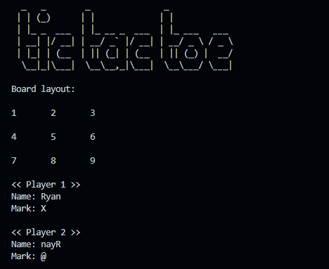
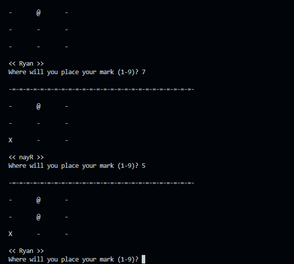
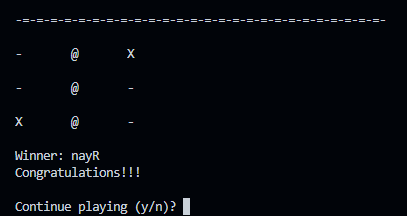

# Tic-tac-toe

Implementation of the game tic-tac-toe made while learning Python

- The players can choose their own marks (instead of just X and O)
- Rematches allowed
- It indexes the board from 1 to 9 (left to right, top to bottom)

---

---

